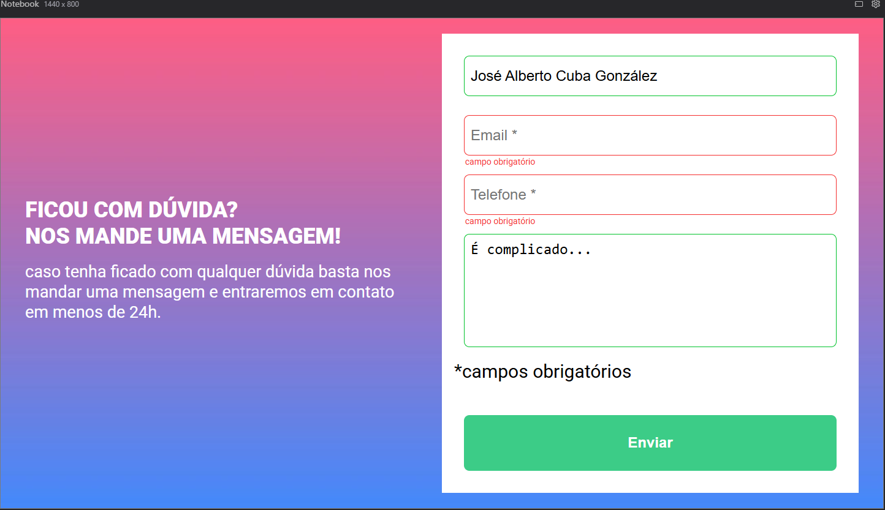

# 📌 Práctica de Formulário com Validação Visual

¡Hola gente! 😊 Bienvenidos a otro proyecto de práctica, esta vez enfocado en la validación visual de formularios, usando las siguientes tecnologías:

- **HTML5** 🏗️  
- **CSS3** (Diseño responsivo) 🎨  
- **JavaScript** (Validación y manipulación de clases) ⚙️  
- **Google Fonts** (Roboto) ✍️  

---

## 🚀 Características principales

<<<<<<< HEAD
🔹 Validación de campos ✅/❌ usando **JS** con manipulación de clases previamente definidas en **CSS**.  
🔹 Los bordes de los inputs se colorean de **verde🟩** si están rellenados, y de **rojo🟥** si están vacíos, además de mostrar un mensaje en la parte inferior de estos.  
🔹 Estructura semántica y clara del **formulario**📋.  

---

## 🖼️ Preview del formulario

=======
✅ Validación de campos usando JS con manipulación de clases previamente definidas en CSS.  
✅ Las bordas de los inputs se colorean de **verde🟩** si están rellenados, y de **rojo🟥** si están vacíos, además de mostrar un mensaje en la parte inferior de estos. ✅❌  
✅ Estructura semántica y clara del formulario. 🧱  

---
>>>>>>> f95df8d (Create README.md)
